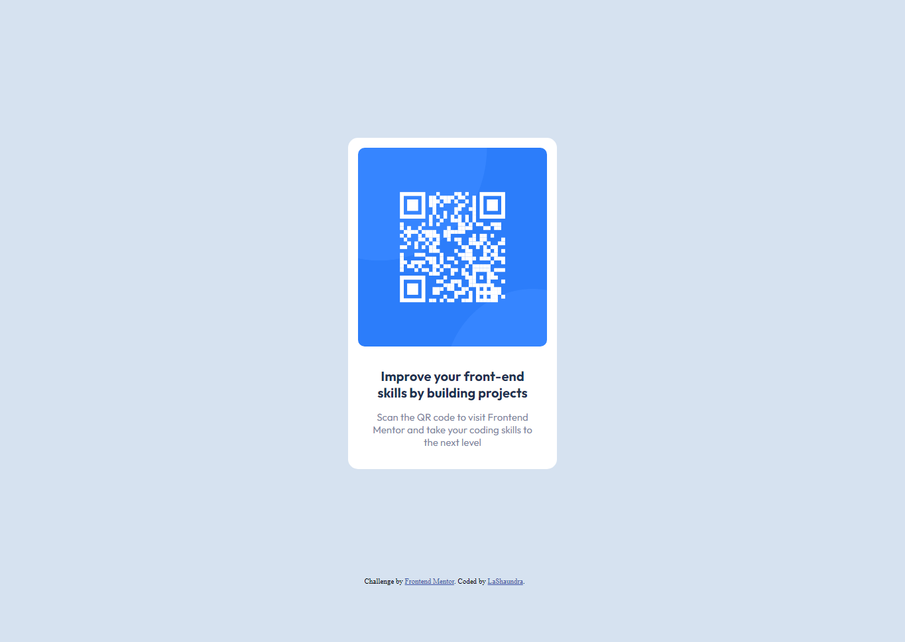

# QR-code-component
# Frontend Mentor - QR code component solution

This is a solution to the [QR code component challenge on Frontend Mentor](https://www.frontendmentor.io/challenges/qr-code-component-iux_sIO_H). Frontend Mentor challenges help you improve your coding skills by building realistic projects. 

## Table of contents

- [Overview](#overview)
  - [Screenshot](#screenshot)
  - [Links](#links)
- [My process](#my-process)
  - [Built with](#built-with)
  - [What I learned](#what-i-learned)
  - [Continued development](#continued-development)
  - [Useful resources](#useful-resources)
- [Author](#author)


## Overview

### Screenshot




### Links

- Solution URL: [Add solution URL here](https://your-solution-url.com)
- Live Site URL: [Add live site URL here](https://your-live-site-url.com)

## My process

### Built with

- Semantic HTML5 markup
- CSS custom properties
- Flexbox

 

### What I learned

I learned how to break the work into segments. I isolated pieces that I wanted to manipulate and styled them accordingly. 


```css
.qr-card{
    background-color:hsl(0, 0%, 100%);
    height: 445px;
    width: 285px;
    margin:200px;
    padding:15px 15px 40px 15px;
    border-radius: 15px;    
}
```


### Continued development

I would like to continue work on positioning my elements. Getting my elements in the correct positions took a considerable amount of time. I'd like to become more familiar with other ways I could have manipulated the text and what frameworks I could have used to get similar results. 


### Useful resources

- [Mozilla Developer Flexbox reference](https://developer.mozilla.org/en-US/docs/Learn/CSS/CSS_layout/Flexbox) - This helped me with positioning the overall element using flexbox.


## Author

- Frontend Mentor - [@Mixhion](https://www.frontendmentor.io/profile/Mixhion)

 
